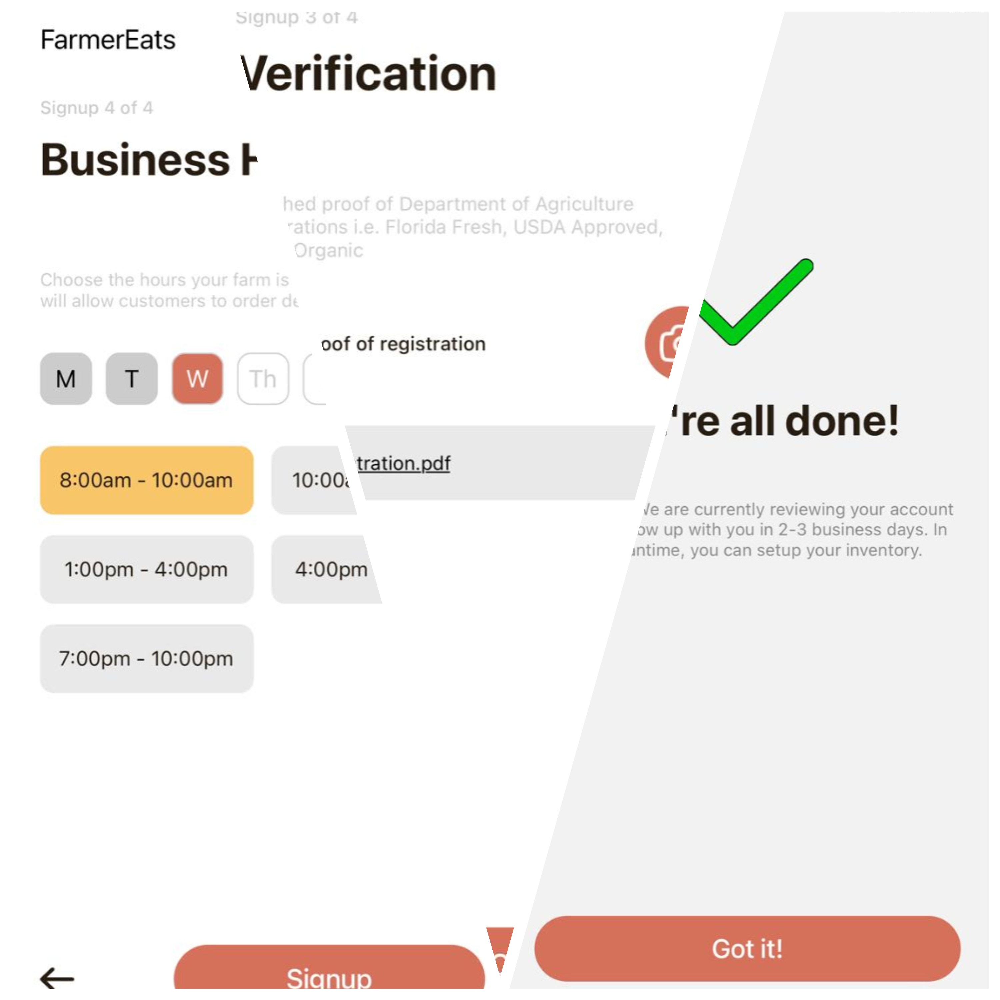

# FarmerEats App

This is an React Native project is built using Expo. This app contains an onboarding screen with 3 slides, and 9 more screens for login/signup. I am using fetch API to make GET and POST requests to the backend server.  

## Screenshots
Onboarding Screen:-

Login Screen:-

Signup Screen:-




## Demo

Watch the app in action:


## Prerequisites

Before you begin, ensure you have the following installed on your local machine:

- [Node.js and npm](https://nodejs.org/) (Node Package Manager)


## Getting Started

Follow these steps to set up and run the project:

### 1. Clone the Repository

First, clone the repository to your local machine using Git.

```bash
git clone https://github.com/ParthPriyadarshiSingh/FarmerEats-App.git
cd FarmerEats-App-clone
```

### 2. Open the Project in VS Code

Open Visual Studio Code and navigate to the project directory.

```bash
code .
```

### 3. Install Dependencies

Install the required dependencies using npm.

```bash
npm install
```

### 4. Start the Expo Development Server

Start the Expo development server using the following command:

```bash
npm start
```

This will start the development server and open the Expo DevTools in your browser.

### 5. Running the App

#### Using Expo Go App

You can run the app on your physical device using the Expo Go app.

1. **For iOS:**
   - Open the built-in Camera app on your iPhone.
   - Scan the QR code displayed in the terminal.
   - Follow the prompt to open the app in the Expo Go app.

2. **For Android:**
   - Open the Expo Go app on your Android device.
   - Scan the QR code displayed in the terminal.


## Troubleshooting


If you encounter any issues while setting up or running the project, try the following:

- Ensure all dependencies are installed correctly.
- Restart the Expo development server and your device.
- Check the [Expo documentation](https://docs.expo.dev/) for more detailed troubleshooting steps.


